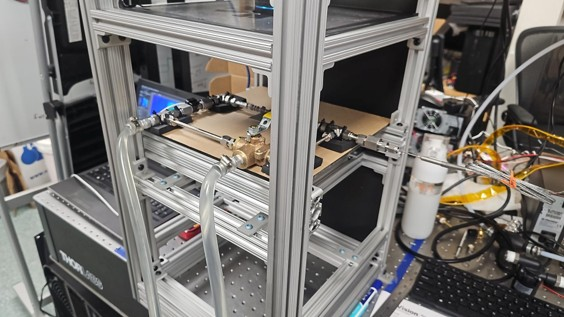
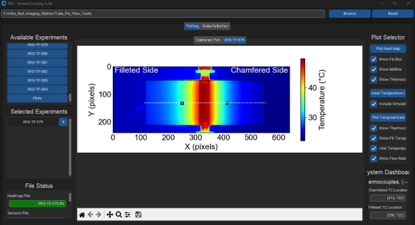
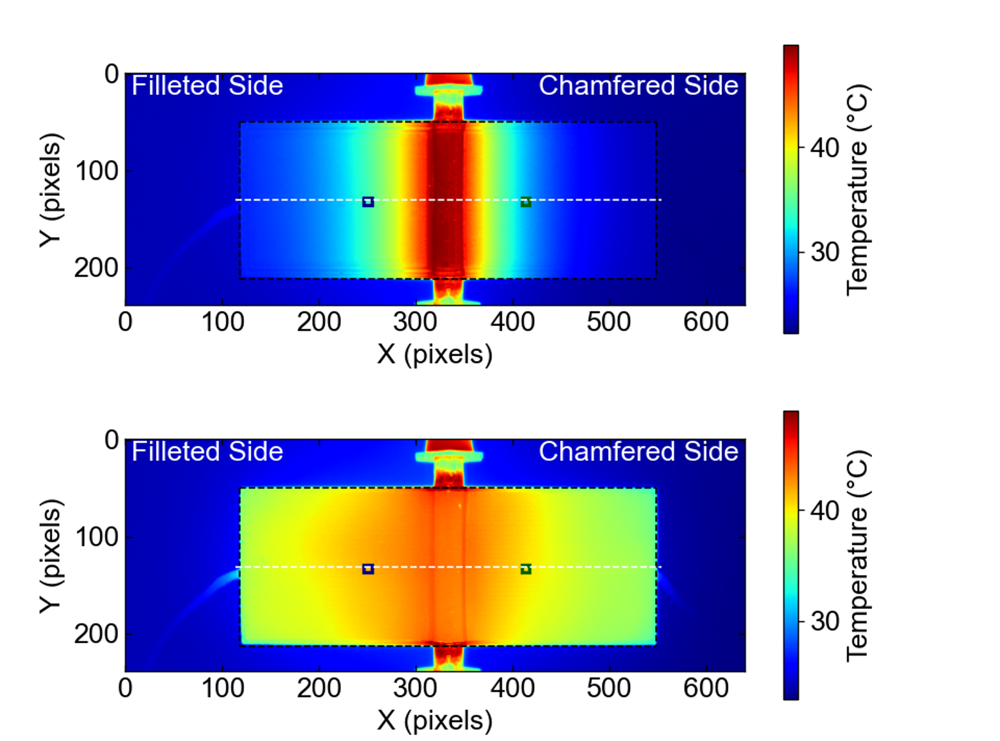

# IRISApp

IRISApp is a desktop analysis and data-collection tool for the 
InfraRed Imaging Station (IRIS). It helps organize tube-fin flow experiments, collect
Arduino sensor output, import infrared/FLIR data, compare experiments, and
generate heat-map, linear-profile, and time-series plots from a single GUI.

## Features

- Browse an experiment directory and load each experiment as its own tab.
- Import thermal heat maps from FITS/FTS files or CSV exports.
- Read Arduino sensor logs containing thermocouple, fluid temperature, and flow-rate data.
- Read FLIR thermocouple exports for chamfered-side and filleted-side measurements.
- Import ANSYS-style simulation profiles and overlay them with experimental profiles.
- Detect fin orientation and fin edges from heat-map data.
- Estimate thermocouple pixel locations from configured fin geometry.
- Plot:
  - heat maps with optional fin boundary, midline, and thermocouple markers
  - linear temperature profiles
  - combined profiles across selected experiments
  - temporal temperature and flow-rate data
- Collect serial data from an Arduino and save it into an experiment folder.

## Media

Repository media is stored in `docs/media/`.

Experimental setup:



GUI preview:



Representative result frame:



Representative result video:

- [Ti-PG infrared result video](docs/media/ti-pg-results-trim.mp4)

## Project Structure

```text
IRISApp/
|-- main.py              # Application entry point
|-- gui.py               # Main CustomTkinter GUI and data-processing logic
|-- config.py            # File names, fin geometry, plotting, and serial settings
|-- requirements.txt     # Python dependencies
|-- sandbox.py           # Small FITS/FTS inspection helper
|-- IRIS.ico             # App icon
|-- docs/media/          # README images and representative result videos
`-- dist/IRIS.exe        # Prebuilt Windows executable, if available
```

## Requirements

- Python 3.11 or newer is recommended.
- Windows is recommended for the packaged executable and default data-collection
  settings. The app uses a Windows-style default serial port (`COM3`).
- macOS can run the app from source with Conda, but hardware-dependent serial
  collection may require changing `SERIAL_PORT` in `config.py`.
- A connected Arduino is only required for the data-collection workflow.

The main Python packages include CustomTkinter, pandas, NumPy, SciPy,
Matplotlib, Astropy, PySerial, OpenCV, Pillow, and PyInstaller.

## Installation

### Option 1: Windows with venv

Clone the repository:

```powershell
git clone https://github.com/BradenS-eng/IRISApp.git
cd IRISApp
```

Create and activate a virtual environment:

```powershell
python -m venv .venv
.\.venv\Scripts\Activate.ps1
```

If PowerShell blocks activation, run:

```powershell
Set-ExecutionPolicy -Scope CurrentUser RemoteSigned
.\.venv\Scripts\Activate.ps1
```

Install dependencies:

```powershell
python -m pip install --upgrade pip
pip install -r requirements.txt
```

### Option 2: macOS with Conda

Clone the repository:

```bash
git clone https://github.com/BradenS-eng/IRISApp.git
cd IRISApp
```

Create and activate a Conda environment:

```bash
conda create -n iris python=3.11
conda activate iris
```

Install dependencies:

```bash
pip install -r requirements.txt
```

## Running the App

Start the GUI from source:

```powershell
python main.py
```

If you only need the packaged app, run:

```powershell
.\dist\IRIS.exe
```

## Experiment Folder Format

The app expects you to choose a parent directory that contains one folder per
experiment. Each experiment folder can contain any of the following recognized
files:

| Data type | Accepted file names |
| --- | --- |
| Heat map | `Heat_Map_Final_Frame.csv`, `Ti_Fin_Flir.csv`, or any `.fts` / `.fits` file |
| Arduino sensors | `sensors.txt` |
| Chamfered-side FLIR data | `Chamfered_Side_TC_Flir.txt` |
| Filleted-side FLIR data | `Filleted_Side_TC_Flir.txt` |
| Simulation data | any file beginning with `IRIS-ANSYS` |

The required names are configured in `config.py`.

## Basic Workflow

1. Launch the app with `python main.py`.
2. Click **Browse** and select the parent folder that contains experiment folders.
3. Select one or more experiments from **Available Experiments**.
4. Use the file-status panel to confirm which heat-map, sensor, FLIR, and
   simulation files were found.
5. Use the plot controls to generate heat maps, linear temperature profiles,
   combined experiment comparisons, or temporal sensor plots.

## Data Collection Workflow

The **Data Collection** tab supports collecting serial output from an Arduino:

1. Select or create an experiment folder.
2. Start the serial monitor.
3. Begin the experiment, which sends `start` over serial.
4. Stop the serial monitor when the run is complete.
5. Move the `.seq` file into the active experiment folder.

By default, serial communication uses:

```python
SERIAL_PORT = "COM3"
BAUD_RATE = 9600
```

Change these values in `config.py` if your Arduino uses a different port or
baud rate.

## Configuration

Most experiment-specific constants live in `config.py`, including:

- accepted input file names
- fin width and height
- chamfered and filleted thermocouple locations
- heat-map edge-detection sensitivity
- serial port and baud rate
- Matplotlib figure sizes, fonts, scales, and colormaps
- comparison mode for combined plots

Update these values before running a new experimental campaign if the geometry,
hardware, or plotting conventions change.

## Building an Executable

PyInstaller is included in `requirements.txt`. A typical Windows build command is:

```powershell
pyinstaller --onefile --windowed --icon IRIS.ico --name IRIS main.py
```

The generated executable will be written to `dist/`.

## Development Notes

- Keep file-name conventions synchronized between `config.py` and this README.
- Store README images and short result videos in `docs/media/`.
- Use `sandbox.py` to inspect FITS/FTS headers when adding support for new
  camera metadata fields.
- Avoid committing generated files such as `__pycache__` unless they are
  intentionally part of a release artifact.
- Hardware-dependent workflows should be tested with the target Arduino and
  FLIR export format before release.
